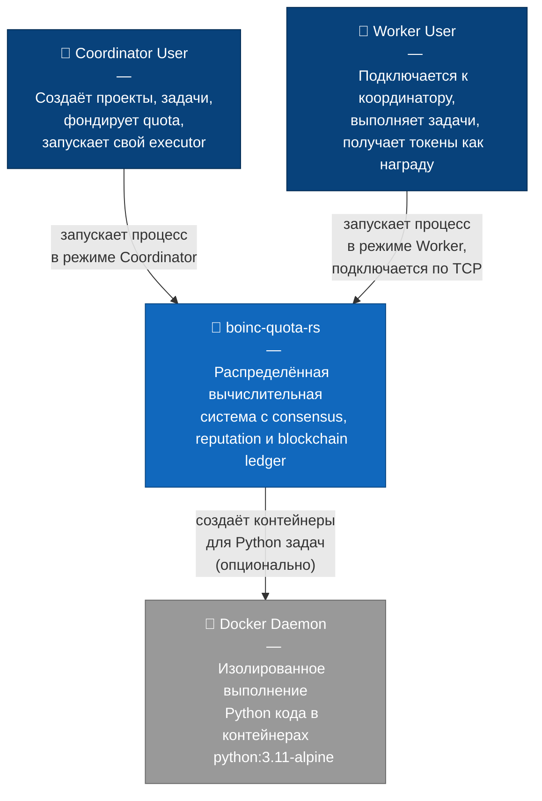
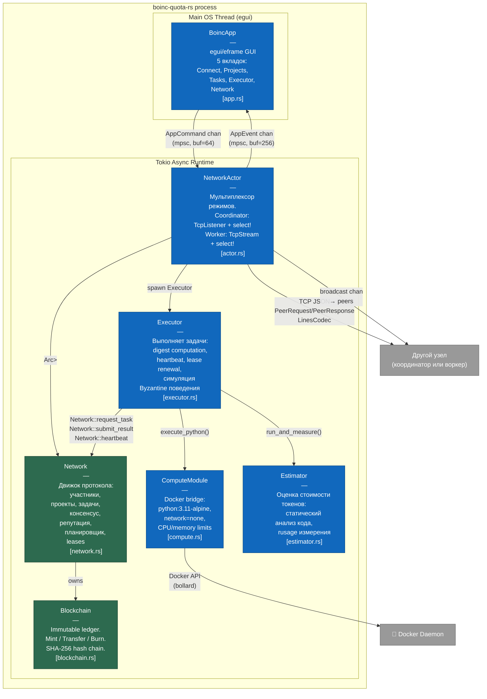
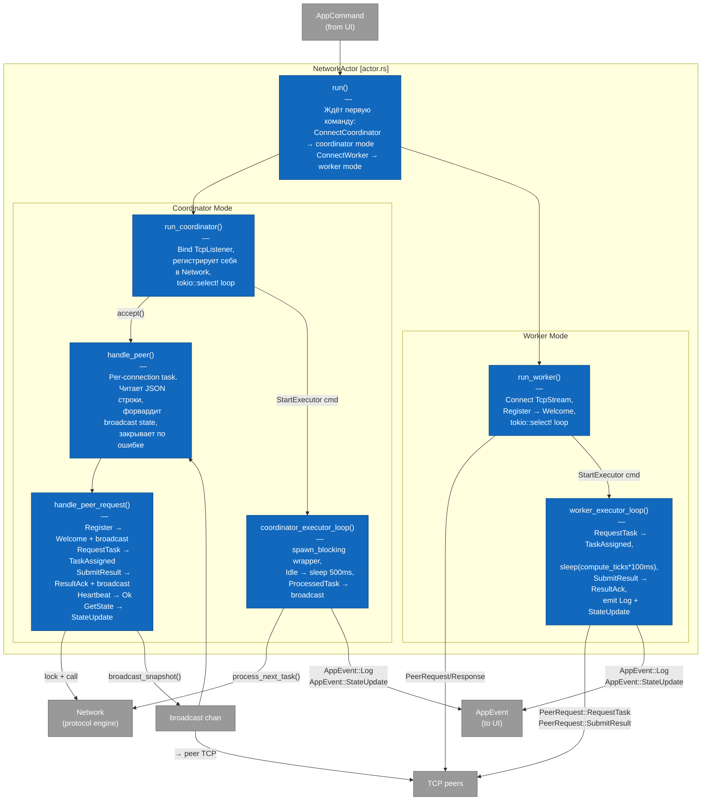

# boinc-quota-rs

Учебная реализация BOINC-подобной распределённой вычислительной системы на Rust.

**Что реализовано:**
- Координатор принимает задачи от клиентов и распределяет их воркерам по TCP
- Воркеры выполняют задачи в изолированных Docker-контейнерах (Python) или детерминированно симулируют результат
- Результаты проходят консенсус, взвешенный по репутации участников
- Балансы и транзакции хранятся в иммутабельном SHA-256 blockchain
- Провальные воркеры штрафуются через lease timeout механизм
- Нативный GUI на egui/eframe для обоих режимов (координатор / воркер)

---

## C4 Level 1 — System Context



---

## C4 Level 2 — Container Diagram

Весь процесс — один бинарник. Внутри две основные нити: GUI (главная OS-нить) и tokio async runtime.



---

## C4 Level 3 — Component Diagram: NetworkActor

Детализация `actor.rs` — самого сложного компонента.



---

## Module Reference

| Файл | Назначение | Ключевые типы |
|------|-----------|--------------|
| [src/main.rs](src/main.rs) | Точка входа. Tokio runtime, MPSC каналы, запуск GUI и NetworkActor | `main()` |
| [src/model.rs](src/model.rs) | Доменные типы | `Participant`, `Project`, `Task`, `TaskReport`, `TaskStatus` |
| [src/protocol.rs](src/protocol.rs) | Все сообщения между компонентами | `AppCommand`, `AppEvent`, `PeerRequest`, `PeerResponse`, `NetworkSnapshot` |
| [src/blockchain.rs](src/blockchain.rs) | SHA-256 hash chain ledger | `Blockchain`, `Block`, `Transaction` |
| [src/network.rs](src/network.rs) | Движок протокола: планировщик, консенсус, репутация, leases | `Network`, `NetworkConfig`, `NetworkError` |
| [src/actor.rs](src/actor.rs) | Async networking loop, мультиплексор режимов | `NetworkActor` |
| [src/executor.rs](src/executor.rs) | Выполнение задач, digest, heartbeat | `Executor`, `ExecutorEvent` |
| [src/compute.rs](src/compute.rs) | Docker Python execution | `ComputeModule`, `ComputeResult`, `ResourceConfig` |
| [src/estimator.rs](src/estimator.rs) | Оценка стоимости токенов | `Estimator`, `CostConfig`, `ResourceMetrics` |
| [src/app.rs](src/app.rs) | egui GUI, 5 вкладок | `BoincApp`, `Tab`, `PayloadMode`, `TaskFilter` |

---

## Key Concepts

### Консенсус, взвешенный по репутации

Каждый воркер отправляет `result_digest` — строку-хэш результата. Координатор накапливает веса по репутации участников. Когда суммарный вес одного digest достигает `consensus_quorum` (по умолчанию 2), задача финализируется.

```
task.reports = [
    { worker_id: 1, digest: "abc", reputation: 3 },
    { worker_id: 2, digest: "abc", reputation: 1 },  // вес "abc" = 4 ≥ quorum → финализация
    { worker_id: 3, digest: "xyz", reputation: 2 },
]
```

Награда распределяется пропорционально репутации воркеров с правильным digest. Остаток (от деления) достаётся воркеру с наибольшей репутацией.

### Blockchain Ledger

Все движения токенов записываются в блоки:
- `Mint { to, amount }` — начальный баланс участника
- `Transfer { from, to, amount }` — перевод (fund, donate, reward)
- `Burn { from, amount }` — штраф за истёкший lease

`balance_of(address)` вычисляется пересчётом всех транзакций. Целостность цепи проверяется через SHA-256 prev_hash. Проекты имеют отдельные адреса: `project_id + 1_000_000_000`.

### Lease-Based Fault Tolerance

При назначении задачи создаётся lease с `expires_at = current_tick + lease_timeout_ticks`. Если воркер не присылает heartbeat или результат до истечения — на следующем `tick()`:
1. lease удаляется
2. репутация воркера снижается на `lease_slash`
3. баланс сжигается на `lease_slash` (Burn tx)
4. задача возвращается в очередь

### Планировщик задач

При `request_task()` выбирается задача с наивысшим приоритетом:
1. Проект с максимальным `quota_available + quota_locked` — первый
2. Внутри проекта — задача с наибольшим `task_id`
3. Воркер не может взять задачу, по которой уже отправил результат

### Docker Isolation

Python payload (`python:<base64-код>`) выполняется в контейнере:
- Image: `python:3.11-alpine` (pull при первом запуске)
- `network_mode: none` — нет исходящего интернета
- CPU shares: 512 (≈0.5 CPU)
- Memory: 256 MB
- Timeout: 10 секунд
- Контейнер удаляется принудительно после выполнения

Fallback: если Docker недоступен — системный `python3` subprocess.

### Byzantine Workers

`Executor::generates_corrupted_result(task_id, payload)` детерминированно решает, будет ли результат неправильным:

```rust
(task_id * 37 + payload_len * 11 + worker_id * 13) % 100 >= reliability_percent
```

`reliability_percent = 95` означает, что ~5% задач воркер намеренно провалит. Это позволяет тестировать консенсус с Byzantine участниками.

---

## Getting Started

### Зависимости

- Rust 1.75+
- (Опционально) Docker Desktop для выполнения Python задач

### Сборка и запуск

```bash
git clone <repo>
cd boinc-qouta-rs
cargo build --release
cargo run
```

Откроется GUI-окно 960×640.

### Python задачи (Docker)

```bash
# Убедиться что Docker запущен
docker pull python:3.11-alpine
```

---

## Quick Demo

### Шаг 1 — Запустить два процесса

Откройте два терминала и запустите `cargo run` в каждом.

### Шаг 2 — Coordinator (первый процесс)

1. Вкладка **Connect** → режим **Coordinator**
2. Listen addr: `0.0.0.0:7878`, Name: `Alice`, Balance: `100`
3. Нажать **Start Server**

### Шаг 3 — Worker (второй процесс)

1. Вкладка **Connect** → режим **Worker**
2. Coord addr: `127.0.0.1:7878`, Name: `Bob`, Balance: `50`
3. Нажать **Connect**

### Шаг 4 — Создать проект и задачу (в Coordinator)

1. Вкладка **Projects** → Create Project: `MyProject` → **Create**
2. Fund Project: ID=1, Amount=30 → **Fund**
3. Вкладка **Tasks** → выбрать проект, Reward=10, Payload: `hello-world` → **Submit**

### Шаг 5 — Запустить Executor на обоих узлах

На **Coordinator**: вкладка **Executor** → Reliability 95%, Ticks 2 → **Start**
На **Worker**: вкладка **Executor** → Reliability 95%, Ticks 2 → **Start**

> Важно: quorum=2, значит нужны результаты от обоих executor'ов для консенсуса.

Задача перейдёт в статус **Completed**. Награда распределится пропорционально репутации.

---

## Task Lifecycle

```
[Submit Task]
     │ lock reward в project quota
     ▼
  Pending  ──────────────────────────────────────────────────┐
     │ request_task()                                         │
     │ create lease (expires_at = tick + timeout)             │
     ▼                                                        │
  Assigned                                                    │
     │                                            lease expired?
     │ submit_result()                             slash + burn
     │ add TaskReport                              re-enqueue ─┘
     │
     ├── consensus reached? ──yes──► Completed
     │                               distribute reward
     │                               adjust reputation (+/-)
     │
     ├── max_reports reached, no consensus? ──► Rejected
     │                                          return quota
     │                                          penalize all
     │
     └── not enough reports yet? ──► stay Assigned
                                     wait for more workers
```

---

## Testing

```bash
cargo test
```

| Модуль | Тестов | Покрытие |
|--------|--------|---------|
| `blockchain.rs` | 12 | mint, transfer, burn, integrity, tamper detection |
| `network.rs` | 16 | task submit, consensus, rewards, lease timeout, reputation |
| `executor.rs` | 3 | reward on consensus, lease loss, idle when no tasks |
| `estimator.rs` | 5 | pre_estimate, calculate_cost, run_and_measure, determinism |

---

## Architecture Decisions

**Почему один процесс для GUI и сети?** — Простота для учебного проекта. GUI нить и tokio runtime разделены через MPSC каналы, что обеспечивает non-blocking UI при любой сетевой активности.

**Почему LinesCodec вместо бинарного протокола?** — Отладка: `tcpdump` или `netcat` показывают читаемый JSON. Для production использовать length-prefixed binary.

**Почему blockchain для балансов?** — Демонстрация аудитируемости: каждое движение токена traceable. `verify_integrity()` детектирует любую постфактум-модификацию.

**Почему reputation-weighted consensus вместо majority?** — Позволяет доверенным воркерам иметь больший вес. Новые участники (reputation=1) нуждаются в поддержке большинства.
